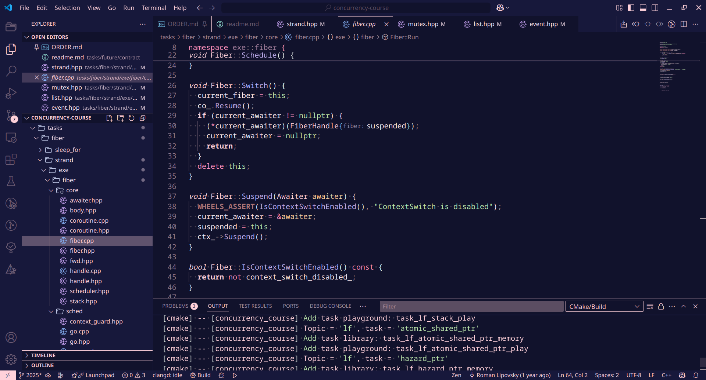

  
  <h1 align="center">Magnolia Theme</h1>

A dark theme with gentle colors with focus on C++.

## Preview

## Installation

1. Install from [VS Marketplace](https://marketplace.visualstudio.com/items?itemName=hipony.magnolia-theme) or run (Ctrl+P) `ext install hipony.magnolia-theme`
2. Run command: `Preferences: Color Theme` → Select "Magnolia Theme"

## License

[BSL-1.0](./LICENSE)
