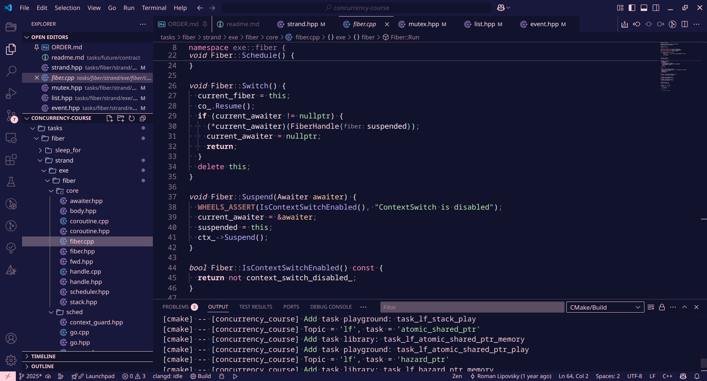

  
  <h1 align="center">Magnolia Theme</h1>

A dark theme with gentle colors with focus on C++.

## Preview

## Installation

1. Install from [VS Marketplace](https://marketplace.visualstudio.com/items?itemName=hipony.magnolia-theme) or run (Ctrl+P) `ext install hipony.magnolia-theme`
2. Run command: `Preferences: Color Theme` → Select "Magnolia Theme"

## Palette

The palette in [`palette/palette.json`](palette/palette.json) is the source of truth. `python3 tools/generate.py` lints the VS Code theme against it and regenerates the exports below.

<!-- generated:palette:start -->

| Color | Hex | Role |
| --- | --- | --- |
| **Backgrounds** | | |
| `bg.base` | `#11122C` | Editor, panels, widgets, menus |
| `bg.chrome` | `#17183B` | Activity bar, side bar, status bar, title bar, tab strip |
| `bg.deep` | `#0D0E22` | Darker than base: unfocused inactive tabs |
| **Text & neutrals** | | |
| `fg` | `#FFD1DA` | Magnolia pink: default foreground and UI accent; control keywords, types |
| `fg.bright` | `#FFEBEF` | Near-white pink: base text, variables |
| `fg.bone` | `#E8EEEA` | Off-white: decorators, language constants, heading 2 |
| `fg.muted` | `#9D8EA4` | Muted mauve: disabled text, secondary labels |
| `fg.faint` | `#6c5c73` | Faint: inactive items, ignored files, resolved markers |
| `fg.rose` | `#9F868A` | Rose grey: punctuation, brackets, selections, line numbers |
| `border` | `#5B4D61` | Contrast borders, table borders |
| **Accents** | | |
| `red` | `#f38ba8` | Errors, deleted, breakpoints, self/this, emphasis |
| `mint` | `#DCE5E0` | Added/inserted, raw code, pale accents |
| `green` | `#bbe5ab` | Strings, numbers, success, ANSI green |
| `blush` | `#FFE6F2` | Modified files, enums, preprocessor directives |
| `gold` | `#ffd600` | Constants, enum members, concepts |
| `sand` | `#ebd391` | Warnings, ANSI yellow |
| `peach` | `#ffce9c` | Parameters, git conflicts, charts orange |
| `punch` | `#FF90BC` | Keywords, object properties |
| `lilac` | `#BFAEED` | Function declarations |
| `taupe` | `#D0B3B5` | Info, links, function calls, property names |
| `cream` | `#F5EEE0` | Enum members, operators, list bullets |
| `petal` | `#f5c2e7` | Escapes, format placeholders, quotes, ANSI magenta |
| `maroon` | `#eba0ac` | Metavariables, JSDoc params, secondary deletions |
| `sky` | `#89dceb` | Type parameters, renamed files, info markers, ANSI cyan |
| `azure` | `#74c7ec` | Heading 5, brackets 5, ANSI blue |
| `periwinkle` | `#b4befe` | Heading 6, markdown link titles |
| `rosewater` | `#f5e0dc` | Cursors, regex ranges |
| `flamingo` | `#f2cdcd` | Packages, snippets, GraphQL aliases, math |
| `comment` | `#A17D9B` | Comments |
| `rust` | `#AA7477` | C++ preprocessor function names |
| **Terminal (ANSI only)** | | |
| `ansi.black` | `#2b2c52` | ANSI black (velvet surface) |
| `ansi.green` | `#aac6a4` | ANSI green (dusty sage) |
| `ansi.yellow` | `#e6cfa3` | ANSI yellow (champagne) |
| `ansi.cyan` | `#9fd8cd` | ANSI cyan (dusty aqua) |
| `ansi.black.bright` | `#454770` | ANSI bright black |
| `ansi.red.bright` | `#f7a3ba` | ANSI bright red |
| `ansi.green.bright` | `#c6debc` | ANSI bright green |
| `ansi.yellow.bright` | `#f1e2bd` | ANSI bright yellow |
| `ansi.periwinkle.bright` | `#ccd6ff` | ANSI bright blue |
| `ansi.petal.bright` | `#f9d8ef` | ANSI bright magenta |
| `ansi.cyan.bright` | `#bfe9e0` | ANSI bright cyan |

Terminal mapping (ANSI 16, shared by the VS Code terminal, Konsole export):

| Slot | Color | Hex |
| --- | --- | --- |
| 0 | `ansi.black` | `#2b2c52` |
| 8 (bright black) | `ansi.black.bright` | `#454770` |
| 1 | `red` | `#f38ba8` |
| 9 (bright red) | `ansi.red.bright` | `#f7a3ba` |
| 2 | `ansi.green` | `#aac6a4` |
| 10 (bright green) | `ansi.green.bright` | `#c6debc` |
| 3 | `ansi.yellow` | `#e6cfa3` |
| 11 (bright yellow) | `ansi.yellow.bright` | `#f1e2bd` |
| 4 | `periwinkle` | `#b4befe` |
| 12 (bright blue) | `ansi.periwinkle.bright` | `#ccd6ff` |
| 5 | `petal` | `#f5c2e7` |
| 13 (bright magenta) | `ansi.petal.bright` | `#f9d8ef` |
| 6 | `ansi.cyan` | `#9fd8cd` |
| 14 (bright cyan) | `ansi.cyan.bright` | `#bfe9e0` |
| 7 | `fg.muted` | `#9D8EA4` |
| 15 (bright white) | `fg.bright` | `#FFEBEF` |

<!-- generated:palette:end -->

## Other apps

- **Konsole**: copy [`exports/konsole/Magnolia.colorscheme`](exports/konsole/Magnolia.colorscheme) to `~/.local/share/konsole/`
- **opencode**: copy [`exports/opencode/magnolia.json`](exports/opencode/magnolia.json) to `~/.config/opencode/themes/`, restart opencode, then select via `/theme`

## License

[BSL-1.0](./LICENSE)
